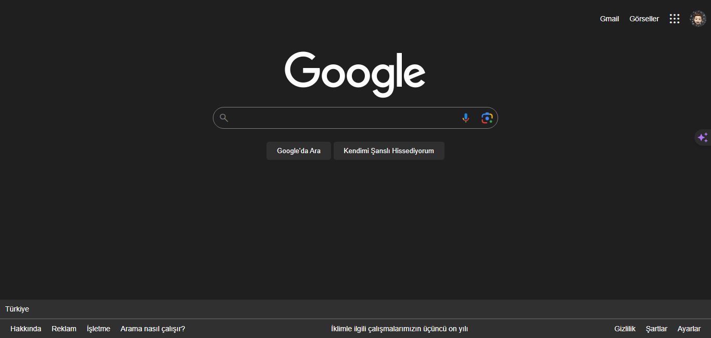

# Google Search page clone

### screenshot


## Installation

```bash
git clone https://github.com/siestaxd/html-google-clone.git
```

## Usage

```linux
cd html-google-clone
code .
```

## License

[MIT](https://choosealicense.com/licenses/mit/)
